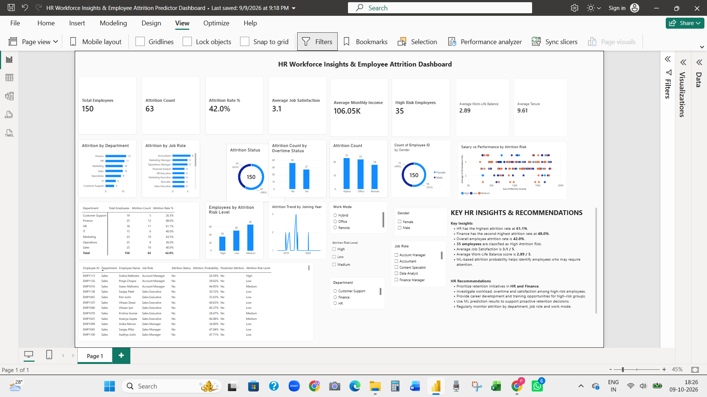

# HR Workforce Insights & Employee Attrition Predictor Dashboard

A Power BI project that explores workforce demographics, employee attrition, compensation, job satisfaction, work-life balance, and attrition risk to support HR decision-making.

## Dashboard Preview

## Project Objective

Build an interactive HR analytics dashboard to monitor workforce patterns, analyze employee attrition, identify groups that may need retention attention, and support evidence-informed workforce planning.

## Tools & Technologies

- Microsoft Power BI
- Power Query
- DAX
- Python
- Logistic Regression
- CSV dataset

## Dataset

The sample dataset contains **150 employee records and 22 fields**, including:

- Employee demographics, department, job role, education, and location
- Joining date and years at company
- Monthly income and performance rating
- Training hours and overtime status
- Work mode, job satisfaction, and work-life balance
- Promotion history and absenteeism
- Attrition status and attrition risk level

## Dashboard Features

- KPI cards for headcount, attrition count, attrition rate, income, satisfaction, and tenure
- Attrition analysis by department and job role
- Attrition comparisons by overtime status and work mode
- Employee risk-level distribution
- Gender and workforce demographic analysis
- Department matrix with employee and attrition metrics
- Interactive slicers for department, gender, work mode, job role, and risk level
- Python Logistic Regression integration for employee-level attrition predictions

## Key Findings

- **Total employees:** 150
- **Employees who left:** 63
- **Overall attrition rate:** 42.0%
- **High-risk employees:** 35
- **Average monthly income:** 106.05K
- **Average job satisfaction:** 3.1 / 5
- **Average work-life balance:** 2.89 / 5
- **Average tenure:** 9.61 years

The project report identifies HR as the department with the highest reported attrition rate (61.1%), followed by Finance (48.0%). These results are based on the sample dataset and should not be interpreted as findings about a real company.

## Machine Learning Note

The project includes a Logistic Regression component using selected HR features to generate employee-level attrition predictions. The current report does not document verified model-evaluation metrics such as accuracy, precision, recall, or AUC. Predictions should be treated as decision-support outputs, not as the sole basis for HR decisions.

## Project Files

- `HR Workforce Insights & Employee Attrition Predictor Dashboard.pbix` — Power BI dashboard
- `employee_attrition_data.csv` — Sample employee dataset
- `HR_Workforce_Insights_Employee_Attrition_Project_Report.docx` — Detailed project report
- `dashboard.png` — Dashboard preview image

## Business Value

The dashboard demonstrates how workforce data can help HR teams monitor attrition patterns, explore potential retention concerns, and support workforce-planning discussions.

## Limitations

- The dataset is a sample and may not represent a real organization.
- Observed relationships do not prove that one factor causes employee attrition.
- Predictive output should be validated before any real-world use.

## Conclusion

This project combines Power BI reporting, Power Query data preparation, DAX measures, and Python-based predictive analytics to demonstrate an end-to-end HR workforce analytics workflow.
